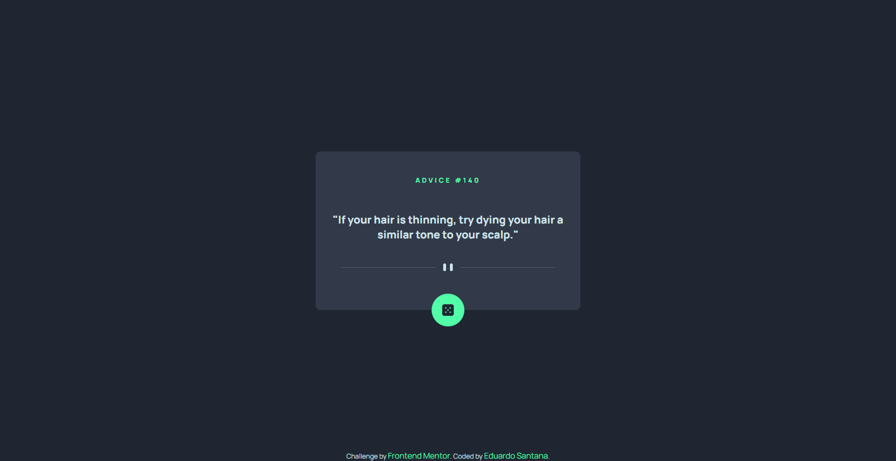
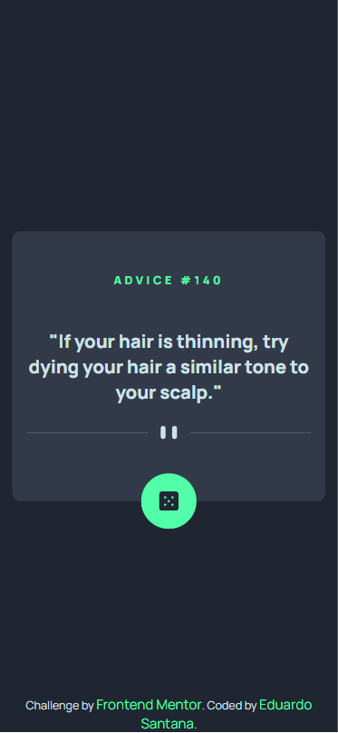

# Frontend Mentor - Aplicativo gerador de conselhos

Essa é uma solução para o [desafio do aplicativo gerador de conselhos que está disponível no site Frontend Mentor](https://www.frontendmentor.io/challenges/advice-generator-app-QdUG-13db). Os desafios do Frontend Mentor ajudam você a melhorar suas habilidades de codificação criando projetos realistas.

## Índice

- [Visão geral](#visão-geral)
   - [O desafio](#o-desafio)
   - [Captura de tela](#captura-de-tela)
   - [Links](#links)
- [Meu processo](#meu-processo)
   - [Construído com](#construído-com)
- [Autor](#autor)
## Visão geral

### O desafio

Os usuários devem ser capazes de:

- Ver o layout ideal para o aplicativo, independente do tamanho da tela do dispositivo
- Veja os estados de foco para todos os elementos interativos na página
- Gere um novo conselho clicando no ícone do dado

### Captura de tela

### Links

- URL da solução: [https://github.com/eduardosantanna/advice-generator-app](https://github.com/eduardosantanna/advice-generator-app)
- URL do site ao vivo: [Adicione URL do site ao vivo aqui](https://your-live-site-url.com)

## Meu processo

### Construído com

- Conceitos de mobile first
- Flexbox
- [Vuejs](https://vuejs.org) - Biblioteca JS

## Autor

- Frontend Mentor - [@LuisZEdu](https://www.frontendmentor.io/profile/LuisZEdu)
